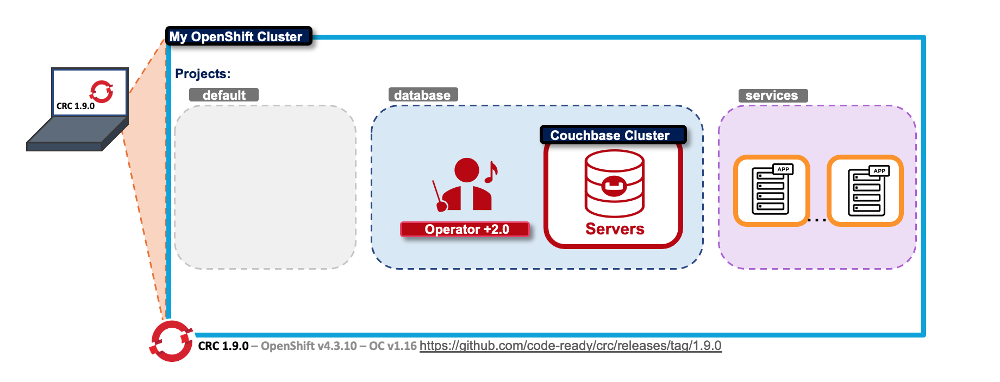
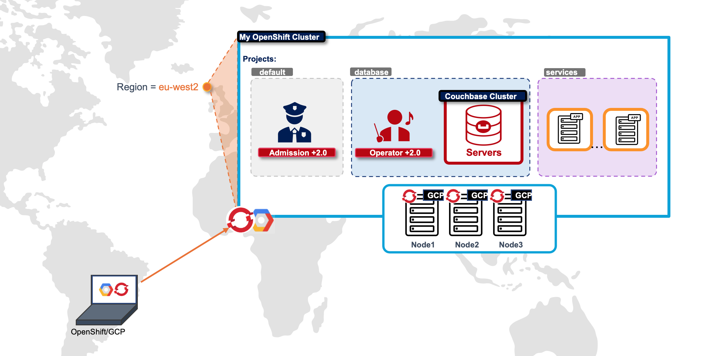
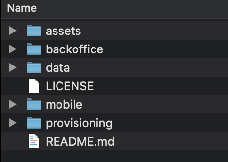

# Why Couchbase Is the Best NoSQL Option for Red Hat OpenShift openshift+couchbase


*Speaker: Steffen Schneider, José Molina*  

Red Hat’s leadership in the container orchestration space with OpenShift mirrors Couchbase’s leadership in the containerized database space with its Autonomous Operator. This fact is the foundation of the partnership between Red Hat and Couchbase. We wanted to take this opportunity to discuss why now is a great time to run Couchbase on Red Hat OpenShift.  You’ll also learn how to install and configure your mobile Couchbase environment using the Couchbase Operator in just a couple of clicks using Operator Lifecycle Manager (OLM) tooling.


## Content

#### 1. Overview
#### 2. Pre-requisites
#### 3. Getting Started
#### 4. Next Steps


## 1. Overview  




### Infraestructure:

| Technology | Version | Description |
| :-- | :-- | :-- |
| OpenShift Client | 1.16 | The OpenShift CLI exposes commands for managing your applications, as well as lower level tools to interact with each component of your system.  |
| OpenShift CRC | 1.9 |Red Hat CodeReady Containers brings a minimal OpenShift 4 cluster to your local computer. This cluster provides a minimal environment for development and testing purposes. CodeReady Containers is mainly targeted at running on developers' desktops. |




Alternatively, you can create your cloud OpenShift (or Kubernetes EKS, GKE, AKS) cluster into the main three Clouds project.

### Database Version:

| Technology | Version | Description |
| :-- | :-- |  :-- | 
| Couchbase Server | 6.6 | Couchbase Server 6.6 adds features and enhancements to improve developer productivity, foster Cloud deployments, and enable operational analytics on globally distributed data.|
| [Optionally] Autonomous Operator | 2.0.2 | The Couchbase Autonomous Operator provides native integration of Couchbase Server with open source Kubernetes and Red Hat OpenShift. It enables you to automate the management of common Couchbase tasks such as the configuration, creation, scaling, and recovery of Couchbase clusters. By reducing the complexity of running a Couchbase cluster, it lets you focus on the desired configuration and not worry about the details of manual deployment and life-cycle management. |

### Demo Application dependencies:

| Technology/Framework | Version | Description |
| :-- | :-- | :-- |
| [Springboot](https://spring.io/projects/spring-boot) | 2.3.4.RELEASE | Spring Boot makes it easy to create stand-alone, production-grade Spring based Applications that you can "just run".|
| [Spring Couchbase data](https://spring.io/projects/spring-data-couchbase) | 4.0.2 | Spring Data for Couchbase is part of the umbrella Spring Data project which aims to provide a familiar and consistent Spring-based programming model for new datastores while retaining store-specific features and capabilities. The Spring Data Couchbase project provides integration with the Couchbase Server database. | 
| [Maven JKube Plugin](https://www.eclipse.org/jkube/) | 1.0.0 | Eclipse JKube is a collection of plugins and libraries that are used for building container images using Docker, JIB or S2I build strategies. Eclipse JKube generates and deploys Kubernetes/OpenShift manifests at compile time too.It brings your Java applications on to Kubernetes and OpenShift by leveraging the tasks required to make your application cloud-native.|

### Repository Folder Structure:



| Folder | Content |
| :-- | :-- |
|**backoffice**| BackOffice application that connects to Couchbase. Java project using Springboot, Spring Couchbase data and JKube to access to Couchbase.|
| **data** | Sample application data |
| **mobile** | work in progress. Future Mobile Application would be placed here |
| **provisioning** | Provisioning script for automatically deploy your Couchbase Cluster on OpenShift |


## 2. Pre-requisites

* Java +1.8
* **OpenShift**/**Kubernetes** Cluster, Client and account.

Alternatively, you can install locally into your laptop the [**Red Hat CodeReady Containers (CRC)**](https://github.com/code-ready/crc/tree/v1.9.0) compatible with [**Couchbase Autonomous Operator +2.0.2 version**](https://docs.couchbase.com/operator/current/prerequisite-and-setup.html).

* Download [**Couchbase Autonomous OpenShift Operator**](https://www.couchbase.com/downloads) latest version (at this point in time is 2.0.2v) and place and rename it as the folder: `$REPOSITORY_HOME/provisioning/openshift/2.0.2`


## 3. Getting Started

There are different ways of run this project depending on the infrastructure you choose for your Couchbase Deployment. 

* **3.1. Local run with direct Couchbase Server**
* **3.2. Deploying Application only on OpenShift (local using CRC or remote platform)**
* **3.3. Deploying Couchbase Cluster and Application on OpenShift using script**


### 3.1. Local run with direct Couchbase Server

Edit your application properties to connect to your Couchbase Data Nodes: 

*demo-connect/src/main/resources/application.properties*

```
# Configure your Cluster nodes
## List of nodes comma separated. At least (replica number + 1) nodes here
couchbase.bootstrap-hosts=localhost

# default bucket
couchbase.user.name=Administrator
couchbase.user.password=password
couchbase.bucket.name=demo
```

And run from `demo-connect` folder:

```
mvn spring-boot:run
```

### 3.2. Deploying Application only on OpenShift (local using CRC or remote platform)

Edit your OpenShift `configmap.yaml` fragment file properties to connect to your Couchbase Data Pods:

*demo-connect/src/main/jkube/configmap.yaml*

```
metadata:
  name: ${project.artifactId}
data:
  application.properties: |-
    couchbase.bootstrap-hosts=cb-demo-0000.cb-demo.dev-001-couchbase.svc
    couchbase.user.name=Administrator
    couchbase.user.password=password
    couchbase.bucket.name=demo
    management.endpoints.web.exposure.include=*
```


Run from `demo-connect` folder:

```
mvn package oc:deploy -Popenshift
```

### 3.3. Deploying Couchbase Cluster and Application on OpenShift using script

```
cd provisioning/openshift/
```

Download Couchbase Autonomous OpenShift Operator latest version (at this point in time is 2.0.2v) and rename it as the folder: 2.0.2

Edit `deploy-couchbase-project.sh` script to introduce your OpenShift login credentials and run it: 

```
./deploy-couchbase-project.sh
```

## 4. Next Steps

* **Work in progress...**
	* Improvements on the Application Demo UI. 
	* Analytics backend Services
	* FTS backend Services
	* Mobile Application
	* Guideline for Kubectl deployments
	* ... and more

